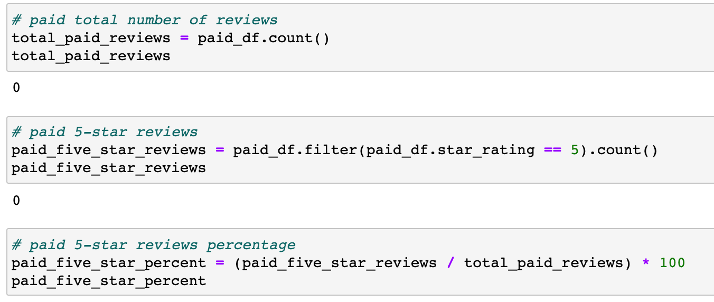
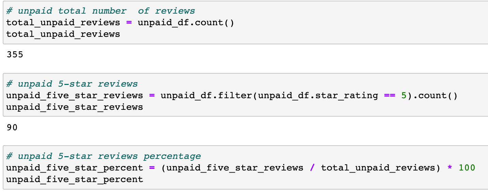

# Amazon_Vine_Analysis

## Table of Contents
- [1.0 Project Overview](#Project-Overview)
  * 1.1 Purpose
  * 1.2 Resources
  
- [2.0 Results](#Results)

- [3.0 Summary](#Summary)

## Project Overview
### 1.1 Purpose

This analysis uses data from the Vine program which is part of Amazon. This program allows companies to recieve reviews of their products. The purpose of this analysis is to determine if there is any biasness towards vine reviewers. 

### 1.2 Resouces
- Data Source: https://s3.amazonaws.com/amazon-reviews-pds/tsv/amazon_reviews_us_Gift_Card_v1_00.tsv.gz
- Software: Python 3.6.1
- Libraries: PySpark 

## Results

The following results are for the gift card reviews through Amazon Vine. 

* The total number of Vine reviews is 0 and non-Vine reviews is 355. 
* The total number of 5 star reviews for Vine reviews is 0 and for non-Vine reviews is 90
* The percentage of 5 star review for Vine reviews is 0% and for non-Vine reviews is 25%

Paid Vine Reviews:                                   

       

Unpaid Review:

 
 

## Summary

In the gift card dataset there is no positive biasness, because there are no reviews from paid Vine reviewers. 
